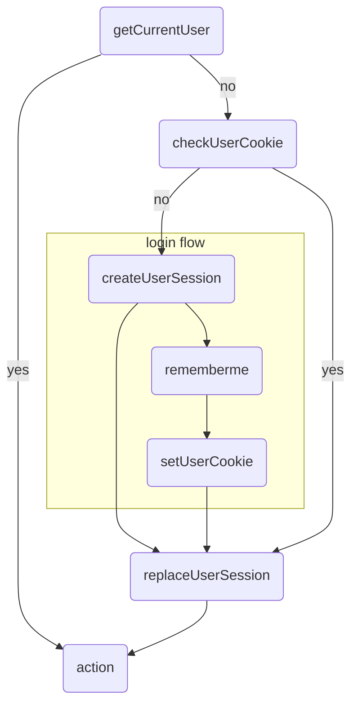

## 用户登陆流程

```mermaid
flowchart
  GCU(getCurrentUser)
  RUS(replaceUserSession)
  CUS(createUserSession)
  RM(rememberme)
  SUC(setUserCookie)
  CUC(checkUserCookie)
  A(action)
  GCU -- yes --> A
  GCU -- no --> CUC
  CUC -- no --> CUS
  subgraph login flow
    CUS --> RM --> SUC
  end
  CUS --> RUS
  SUC --> RUS
  CUC -- yes --> RUS
  RUS --> A
```

