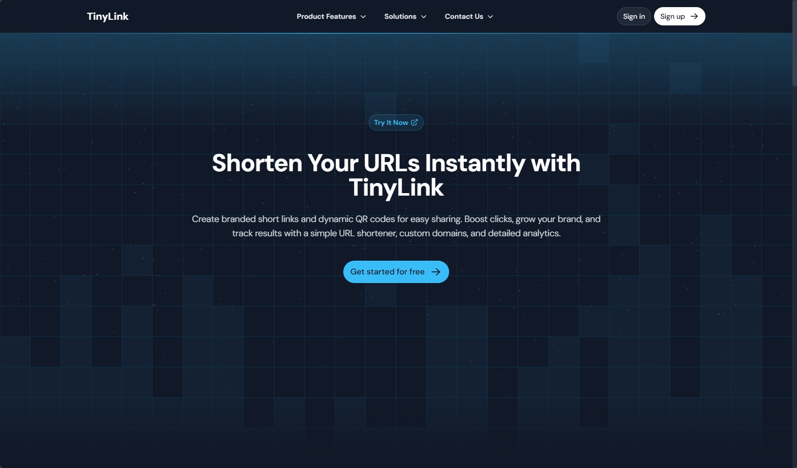

<a href="https://web.a.app">
  
</a>

# @ttpos/a-app-website

URL website application built with Nuxt.js, live at [web.a.app](https://web.a.app)

## Features

- 🚀 Built with [Nuxt.js](https://nuxt.com/) for optimal performance
- 🔄 Continuous deployment via GitHub Actions
- ☁️ Hosted on Cloudflare Pages
- 📱 Responsive design for all devices
- 🎨 Powered by [@nuxt/ui-pro](https://ui.nuxt.com/pro)

## Prerequisites

Before you begin, ensure you have installed:
- [Node.js](https://nodejs.org/) (v20.14.0)
- [pnpm](https://pnpm.io/) (v9.9.0)

## Getting Started

### Environment Setup

1. Set up your environment variables:
```bash
cp .env.example .env
```

2. Configure the `.env` file with your credentials:
```env
# Docker images name
POD_NAME=

# Production license for @nuxt/ui-pro, get one at https://ui.nuxt.com/pro/purchase
NUXT_UI_PRO_LICENSE=

# Public URL, used for OG Image when running nuxt generate
NUXT_PUBLIC_SITE_URL=

# Public URL for the static assets. Default is the root URL.
NUXT_CDNURL=

# Nitro Configuration
# The Nitro runtime preset to use for deployment.
# Options include:
# - 'cloudflare_module': For deploying to Cloudflare worker.
# - 'vercel': For deploying to Vercel.
# - 'node': For using the Node.js runtime.
# - 'node_cluster': For deploying with Node.js in a clustered setup.
# This variable allows you to dynamically select the appropriate runtime environment
# based on your deployment target.
DEPLOY_RUNTIME=cloudflare_module

# Debug Mode
# Toggle debug mode. Set to true for enabling debug logs and features.
NUXT_DEBUG=true
```

### Development

1. Install dependencies:
```bash
pnpm install
```

2. Start the development server:
```bash
pnpm dev
```

3. Open [http://localhost:5000](http://localhost:5000) in your browser.

## Build and Production

Build the application for production:
```bash
pnpm generate
```

Preview the production build:
```bash
pnpm preview
```

## Deployment

This project uses GitHub Actions for CI/CD. The deployment workflow is defined in `.github/workflows/cloudflare-site.yml`.

### Notes

- Make sure to obtain a valid [@nuxt/ui-pro license](https://ui.nuxt.com/pro/purchase) before deploying to production
- The deployment process will automatically handle static asset optimization and CDN distribution
- For local development, `NUXT_DEBUG=true` provides additional debugging information
